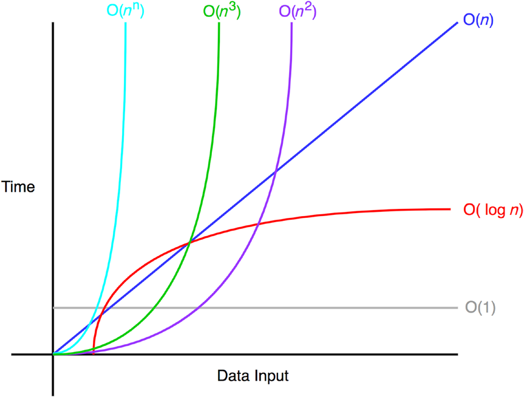

# Big-O Notation

---

Time and space complexity analysis.
It represents the worst-case complexity of an algorithm.




| n    | O(1) | O(log2 n) | O(n) | O(n^2) | O(n^n)    |
|------|------|-----------|------|--------|-----------|
| 1    | 1    | 1         | 1    | 1      | 1         |
| 10   | 1    | 3.3       | 10   | 100    | 10^10     |
| 100  | 1    | 6.6       | 100  | 10000  | 100^100   |
| 1000 | 1    | 9.9       | 1000 | 1000^2 | 1000^1000 |

## Rules

### Coefficient Rule - Get Rid of Constants

If `fn(n)` is `O(g(n))`, then `kf(n)` is `O(g(n))`, for any constant k > 0.

That means `5f(n)` and `f(n)` have the same notation of `O(f(n))`.

As `n` approaches infinity, the other coefficient becomes negligible.

**Functions with time complexity of O(n)**

```js
function c1(n) {
    let count = 0
    for (let i = 0; i <= n; i++) {
        count += i
    }
    return count
}

function c2(n) {
    let count = 0
    for (let i = 0; i <= n * 5; i++) {
        count += i
    }
    return count
}

function c3(n) {
    let count = 0
    for (let i = 0; i <= n; i++) {
        count += i
    }
    count += n
    return count
}
```

### Sum Rule - Add Big-Os Up

If `f(n)` is `O(h(n))` and `g(n)` is `O(p(n))`, then `f(n)+g(n) is O(h(n)+p(n))`.

```js
function c(n) {
    let count = 0
    for (let i = 0; i <= n; i++) {
        count += i
    }
    for (let i = 0; i <= n; i++) {
        count += i
    }
    return count
}
```

Function `c` has complexity `f(n) = 2n` which is `O(n) = n` after applying the coefficient rule.

### Product Rule - Multiply Big-Os

If `f(n)` is `O(h(n))` and `g(n)` is `O(p(n))`, then `f(n)g(n)` is `O(h(n)p(n))`

```js
function c(n) {
    let count = 0
    for (let i = 0; i <= n; i++) {
        count += i
        for (let j = 0; j <= n; j++) {
            count += j
        }
    }
    return count
}
```

Function `c` has complexity `f(n) = n*n` which is `O(n) = n^2`.

### Polynomial Rule - Big-O to the power of k

If `f(n)` is a polynomial of degree k, then `f(n)` is `O(k^n)`.

```js
function c1(n) {
    let count = 0
    for (let i = 0; i <= n*n; i++) {
        count += i
    }
    return count
}
```

Function `c` has complexity `f(n) = n*n` which is `O(n) = n^2`.
